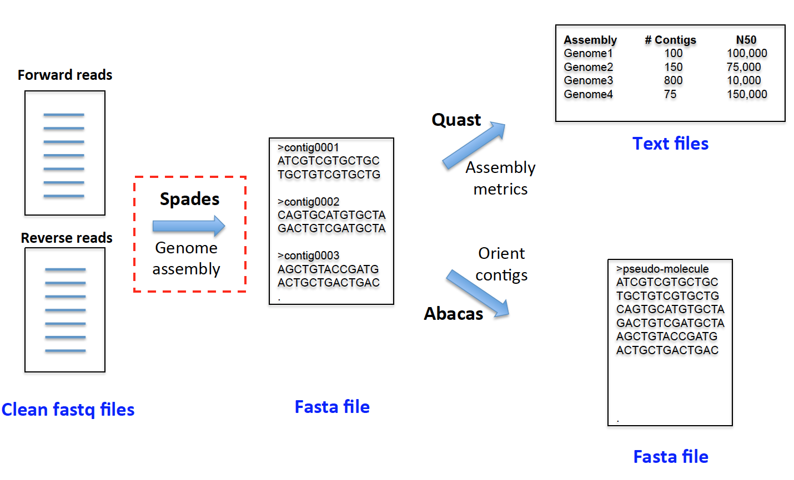
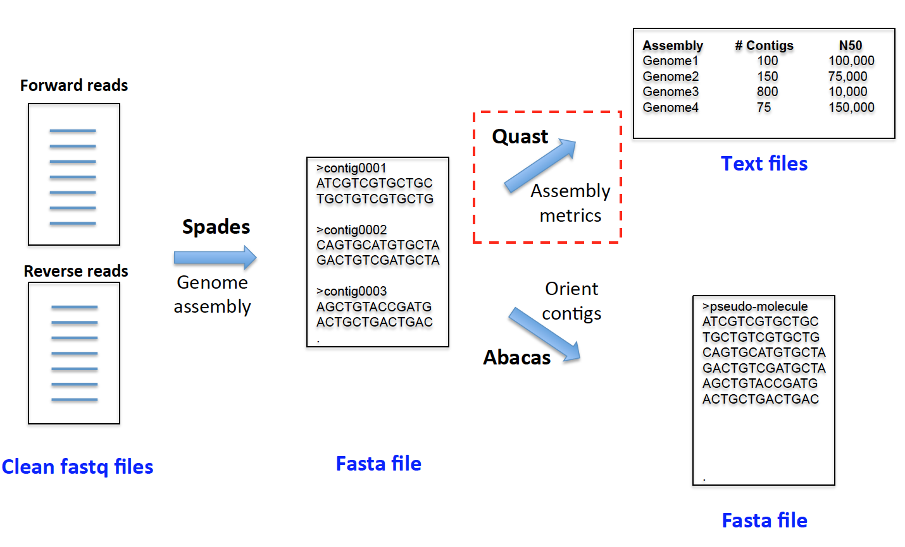
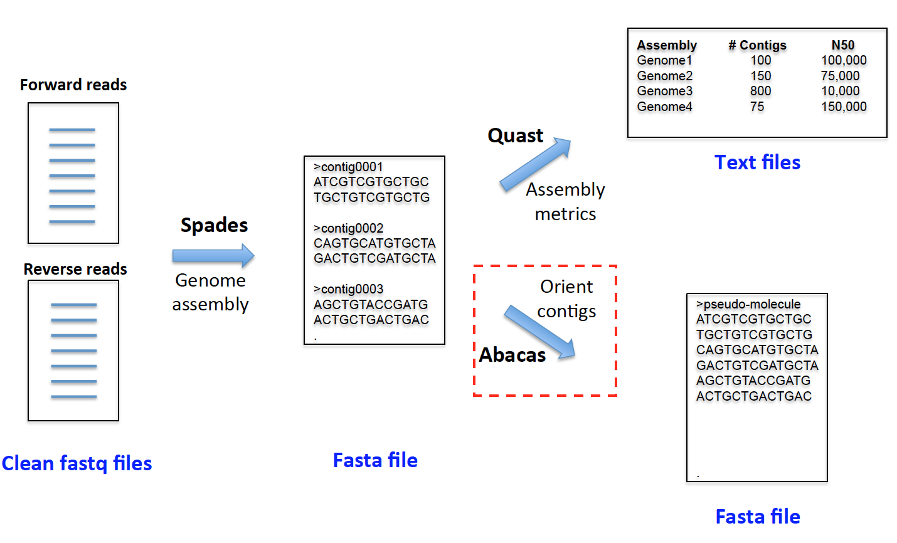
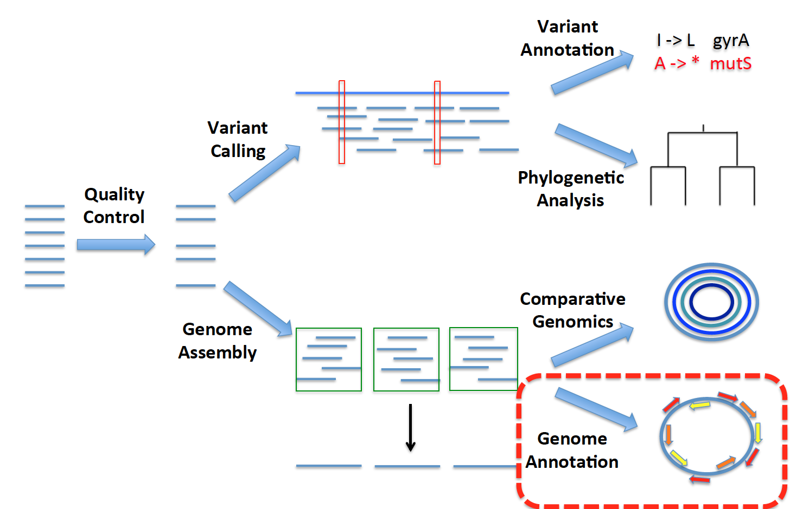
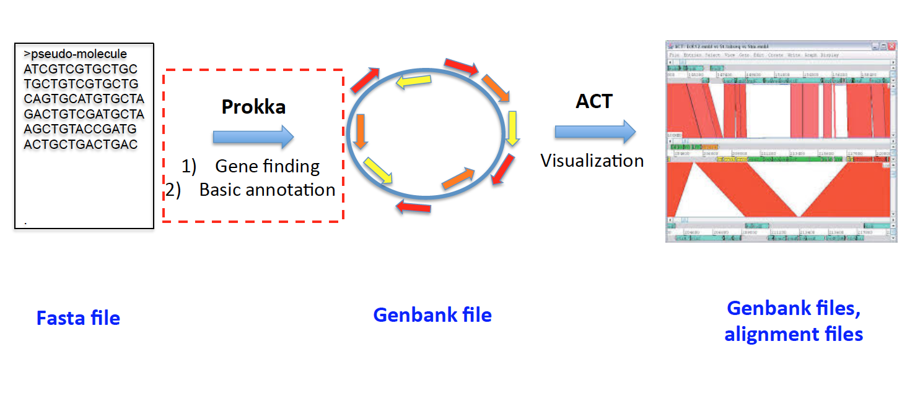
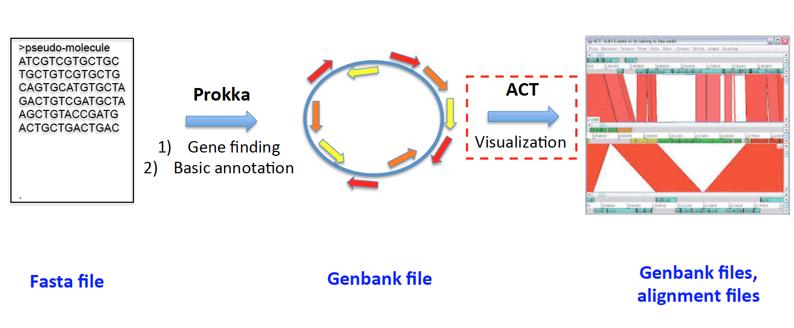

Day 2 AM
=============
[[HOME]](https://github.com/alipirani88/Comparative_Genomics/blob/master/README.md)

On day 1 we worked through a pipeline to map short-read data to a pre-existing assembly and identify single-nucleotide variants (SNVs) and small insertions/deletions. However, what this sort of analysis misses is the existence of sequence that is not present in your reference. Today we will tackle this issue by assembling our short reads into larger sequences, which we will then analyze to characterize the functions unique to our sequenced genome.   


Execute the following command to copy files for this morning’s exercises to your workshop home directory: 

```
> Note: Make sure you change 'username' in the commands below to your 'uniqname'. 

wd

#or 

cd /scratch/micro612w20_class_root/micro612w20_class/username

> Note: Check if you are in your home directory(/scratch/micro612w20_class_root/micro612w20_class/username) by executing 'pwd' in terminal. 'pwd' stands for present working directory and it will display the directory you are in.

pwd

> Note: Copy files for this morning's exercise in your home directory.

cp -r /scratch/micro612w20_class_root/micro612w20_class/shared/data/day2am ./
```

Genome Assembly using [Spades](http://bioinf.spbau.ru/spades) Pipeline
------------------------------
[[back to top]](https://github.com/alipirani88/Comparative_Genomics/blob/master/day2aming/README.md)
[[HOME]](https://github.com/alipirani88/Comparative_Genomics/blob/master/README.md)


There are a wide range of tools available for assembly of microbial genomes. These assemblers fall in to two general algorithmic categories, which you can learn more about [here](?). In the end, most assemblers will perform well on microbial genomes, unless there is unusually high GC-content or an over-abundance of repetitive sequences, both of which make accurate assembly difficult.

Here we will use the Spades assembler with default parameters. Because genome assembly is a computationally intensive process, we will submit our assembly jobs to the cluster, and move ahead with some pre-assembled genomes, while your assemblies are running.



> ***i. Create directory to hold your assembly output.***

Create a new directory for the spades output in your day2am folder

```
> Note: Make sure you change 'username' in the below command with your 'uniqname'. 

d2m

#or

cd /scratch/micro612w20_class_root/micro612w20_class/username/day2am

> We will create a new directory in day2am to save genome assembly results:

mkdir MSSA_SRR5244781_assembly_result 

```

Now, we will use a genome assembly tool called Spades for assembling the reads.

> ***ii. Test out Spades to make sure it's in your path***

Load the workshop conda environment micro612. To make sure that your conda paths are set up correctly, try running Spades with the –h (help) flag, which should produce usage instruction. 

```
> check if spades is working. 

conda activate micro612

spades.py -h     

```

> ***iii. Submit a cluster job to assemble***

Since it takes a huge amount of memory and time to assemble genomes using spades, we will run a slurm script on great lakes cluster for this step.

Now, open the spades.sbat file residing in the day2aming folder with nano and add the following spades command to the bottom of the file. Replace the EMAIL_ADDRESS in spades.sbat file with your actual email-address. This will make sure that whenever the job starts, aborts or ends, you will get an email notification.

```
> Open the spades.sbat file using nano:

nano spades.sbat

> Now replace the EMAIL_ADDRESS in spades.sbat file with your actual email-address. This will make sure that whenever the job starts, aborts or ends, you will get an email notification.

> Copy and paste the below command to the bottom of spades.sbat file.

spades.py -1 forward_paired.fq.gz -2 reverse_paired.fq.gz -o MSSA_SRR5244781_assembly_result/ --careful

```

> ***iv. Submit your job to the cluster with sbatch***

```
sbatch spades.sbat
```

> ***v. Verify that your job is in the queue with the squeue command***

```
squeue -u username 
```

Submit PROKKA annotation job
----------------------------

Since Prokka annotation is a time intensive run, we will submit an annotation job and go over the results later at the end of this session. 


Before we submit the job, run this command to make sure that prokka is setup properly in your environment.

```
prokka –setupdb
```

In your day2am directory, you will find a prokka.sbat script. Open this file using nano and change the EMAIL_ADDRESS to your email address.

```
nano prokka.sbat

```

Now add these line at the end of the slurm script.

```

mkdir SRR5244781_prokka 
prokka -kingdom Bacteria -outdir SRR5244781_prokka -force -prefix SRR5244781 SRR5244781_contigs_ordered.fasta

```

Submit the job using sbatch

```
sbatch prokka.sbat
```


Assembly evaluation using [QUAST](http://bioinf.spbau.ru/quast)
---------------------------------
[[back to top]](https://github.com/alipirani88/Comparative_Genomics/blob/master/day2aming/README.md)
[[HOME]](https://github.com/alipirani88/Comparative_Genomics/blob/master/README.md)

The output of an assembler is a set of contigs (contiguous sequences), that are composed of the short reads that we fed in. Once we have an assembly we want to evaluate how good it is. This is somewhat qualitative, but there are some standard metrics that people use to quantify the quality of their assembly. Useful metrics include: i) number of contigs (the fewer the better), ii) N50 (the minimum contig size that at least 50% of your assembly belongs, the bigger the better). In general you want your assembly to be less than 200 contigs and have an N50 greater than 50 Kb, although these numbers are highly dependent on the properties of the assembled genome. 

To evaluate some example assemblies we will use the tool quast. Quast produces a series of metrics describing the quality of your genome assemblies. 



> ***i. Run quast on a set of previously generated assemblies***

Now to check the example assemblies residing in your day2am folder, run the below quast command. Make sure you are in day2am folder in your home directory using 'pwd'

SInce Quast needs an older version of python, we will deactivate the current environment and run quast outside micro612 environment.  

```
conda deactivate 

module load python2.7-anaconda/2019.03

quast.py -o quast SRR5244781_contigs.fasta SRR5244821_contigs.fasta
```

The command above will generate a report file in /scratch/micro612w20_class_root/micro612w20_class/username/day2am/quast

> ***ii. Explore quast output***

QUAST creates output in different formats such as html, pdf and text. Now lets check the report.txt file residing in quast folder for assembly statistics. Open report.txt using nano.

```
less quast/report.txt
```

Check the difference between the different assembly statistics. Also check the different types of report it generated.

Generating multiple sample reports using [multiqc](http://multiqc.info/)
--------------------------------------------------


Let's imagine a real-life scenario where you are working on a project which requires you to analyze and process hundreds of samples. Having a few samples with extremely bad quality is very commonplace. Including these bad samples into your analysis without adjusting their quality threshold can have a profound effect on downstream analysis and interpretations. 

- Question: How will you find those bad apples?  

Yesterday, we learned how to assess and control the quality of samples as well as screen for contaminants. But the problem with such tools or any other tools is, they work on per-sample basis and produce only single report/logs per sample. Therefore, it becomes cumbersome to dig through each sample's reports and make appropriate quality control calls.  

Thankfully, there is a tool called multiqc which parses the results directory containing output from various tools, reads the log report created by those tools (ex: FastQC, FastqScreen, Quast), aggregates them and creates a single report summarizing all of these results so that you have everything in one place. This helps greatly in identifying the outliers and removing or reanalysizing it individually.

Lets take a look at one such mutiqc report that was generated using FastQC results on *C. difficile* samples.

Download the html report Cdiff_multiqc_report.html from your day2am folder.

```
#Note: Make sure you change 'username' in the below command to your 'uniqname'.

scp username@greatlakes-xfer.arc-ts.umich.edu:/scratch/micro612w20_class_root/micro612w20_class/username/day2am/Cdiff_multiqc_report.html /path-to-local-directory/

```

- Question: Open this report in a browser and try to find the outlier sample/s

- Question: What is the most important parameter to look for while identifying contamination or bad samples?

- Question: What is the overall quality of data? 

Lets run multiqc on one such directory where we ran and stored FastQC, FastQ Screen and Quast reports.

if you are not in day2am folder, navigate to it and change directory to multiqc_analysis

```
d2m 

#or

cd /scratch/micro612w20_class_root/micro612w20_class/username/day2am/

cd multiqc_analysis

#Activate workshop conda environment

conda activate micro612

multiqc -h

#Run multiqc on sample reports

multiqc ./ --force --filename workshop_multiqc

#Check if workshop_multiqc.html report was generated

ls

#transfer this report to your local system and open it in a browser for visual inspection

scp username@flux-xfer.arc-ts.umich.edu:/scratch/micro612w20_class_root/micro612w20_class/username/day2am/workshop_multiqc.html /path-to-local-directory/

```

The report contains the Assembly, Fastq Screen and FastQC report for a mixture of 51 organisms' sequence data. Sample names for Assembly statistics ends with "l500_contigs".

- Question: Which two sample's genome length i.e column Length (Mbp) stand out from all the other genome lengths and what is the reason (hint – check their GC % and their FastQ Screen result)?

- Question: Which sample has the worst N50 value? What do you think must be the reason?

- Question: Which sample has the second worst N50 value? Is it the same or a different issue from the worst sample?


Compare assembly to reference genome and post-assembly genome improvement
-------------------------------------------------------------------------
[[back to top]](https://github.com/alipirani88/Comparative_Genomics/blob/master/day2aming/README.md)
[[HOME]](https://github.com/alipirani88/Comparative_Genomics/blob/master/README.md)

Once we feel confident in our assembly by using quast or multiQC, let's compare it to our reference to see if we can identify any large insertions/deletions using a graphical user interface called Artemis Comparison Tool (ACT) for visualization. 


In order to simplify the comparison between assembly and reference, we first need to orient the order of the contigs to reference. 



> ***i. Run abacas to orient contigs to the reference***

To orient our contigs relative to the reference we will use a tool called abacas. [ABACAS](http://www.sanger.ac.uk/science/tools/pagit) aligns contigs to a reference genome and then stitches them together to form a “pseudo-chromosome”. 

Go back to flux and into the directory where the assembly is located.

```
d2m

#or

cd /scratch/micro612w20_class_root/micro612w20_class/username/day2am/
```

Now, we will run abacas using these input parameters: 

1) your reference sequence (-r FPR3757.fasta), 

2) your contig file (-q SRR5244781_contigs.fasta), 

3) the program to use to align contigs to reference (-p nucmer), 

4) append unmapped contigs to end of file (-b), 

5) use default nucmer parameters (-d), 

6) append contigs into pseudo-chromosome (-a), 

7) the prefix for your output files (–o SRR5244781_contigs_ordered) 

Source the relevant abacas dependencies and Check if abacas can be properly invoked:

```
source /scratch/micro612w20_class_root/micro612w20_class/shared/bin/PAGIT_2020/PAGIT/sourceme.pagit

abacas.1.3.1.pl -h
```

Run abacas on assembly:

```
abacas.1.3.1.pl -r FPR3757.fasta -q SRR5244781_contigs.fasta -p nucmer -b -d -a -o SRR5244781_contigs_ordered
```

> ***ii. Use ACT to view contig alignment to reference genome***

- Make a new directory by the name ACT_contig_comparison in your day2am folder and copy relevant abacas/ACT comparison files to it. 


```
mkdir ACT_contig_comparison

cp FPR3757.gb SRR5244781_contigs_ordered* ACT_contig_comparison/
```

- Use scp to get ordered fasta sequence and .cruch file onto your laptop 

```
> Dont forget to change username and /path-to-local-ACT_contig_comparison-directory/ in the below command

scp -r username@flux-xfer.arc-ts.umich.edu:/scratch/micro612w20_class_root/micro612w20_class/username/day2am/ACT_contig_comparison/ /path-to-local-directory/

```

- Read files into ACT

```
Go to File on top left corner of ACT window -> open 
Sequence file 1 = FPR3757.gb 
Comparison file 1  = SRR5244781_contigs_ordered.crunch 
Sequence file 2  = SRR5244781_contigs_ordered.fasta

Click Apply button

Dont close the ACT window
```

- Notice that the alignment is totally beautiful now!!! Scan through the alignment and play with ACT features to look at genes present in reference but not in assembly. Keep the ACT window open for further visualizations.


 
Genome Annotation
-----------------
[[back to top]](https://github.com/alipirani88/Comparative_Genomics/blob/master/day2aming/README.md)
[[HOME]](https://github.com/alipirani88/Comparative_Genomics/blob/master/README.md)



**Identify protein-coding genes with [Prokka](http://www.vicbioinformatics.com/software.prokka.shtml)**


From our ACT comparison of our assembly and the reference we can clearly see that there is unique sequence in our assembly. However, we still don’t know what that sequence encodes! To try to get some insight into the sorts of genes unique to our assembly we will run a genome annotation pipeline called Prokka. Prokka works by first running *de novo* gene prediction algorithms to identify protein coding genes and tRNA genes. Next, for protein coding genes Prokka runs a series of comparisons against databases of annotated genes to generate putative annotations for your genome. 


Earlier, we submitted a prokka job which should be completed by now. In this exercise, we will go over the prokka results and copy annotation files to our local system that we can then use for ACT visualization.

> ***i.  Use scp or cyberduck to get Prokka annotated genome on your laptop. Dont forget to change username in the below command


```
cd SRR5244781_prokka

ls 

scp -r username@flux-xfer.arc-ts.umich.edu:/scratch/micro612w16_fluxod/username/day2am/SRR5244781_prokka/ /path-to-local-ACT_contig_comparison-directory/

```

> ***ii. Reload comparison into ACT now that we’ve annotated the un-annotated!***



Read files into ACT

```
Go to File on top left corner of ACT window -> open 
Sequence file 1 = FPR3757.gb 
Comparison file 1  = SRR5244781_contigs_ordered.crunch 
Sequence file 2  = SRR5244781_contigs_ordered.gbf
```

- Play around with ACT to see what types of genes are unique to the MSSA genome SRR5244781 compared to the MRSA genome!

The MRSA reference genome is on the top and the MSSA assembly is on the bottom of you screen. 

What genes (in general) do you expect to be in the MRSA genome but not the MSSA genome? Some sort of resistance genes, right? Indeed USA300 MRSA acquired the SCCmec cassette (which contains a penicillin binding protein and mecR1) which confers resistance to methicillin and other beta-lactam antibiotics. 

Click on GoTo->FPR3757.gb->Navigator-> GoTo and search by gene name. Search for mecR1. Is it in the MSSA genome? 

It also acquired the element ACME. One gene on ACME is arcA. 

Click on GoTo->FPR3757.gb->Navigator-> GoTo and search by gene name. Search for arcA. Is it in the MSSA genome? Do you see other arc genes that may be in an operon with arcA? 

Scroll through the length of the genome. Are there any genes in the MSSA genome that are not in the MRSA genome? 

See [this](https://github.com/alipirani88/Comparative_Genomics/blob/master/_img/day2_morning/day2am_mecA.png) diagram and paper for more information on the features of USA300 MRSA: 

Image from David & Daum Clin Microbiol Rev. 2010 Jul;23(3):616-87. doi: 10.1128/CMR.00081-09.

Using abacas and ACT to compare VRE/VSE genome 
----------------------------------------------

Now that we learned how ACT can be used to explore and compare genome organization and differences, try comparing VSE_ERR374928_contigs.fasta, a Vancomycin-susceptible Enterococcus against a Vancomycin-resistant Enterococcus reference genome Efaecium_Aus0085.fasta that are placed in VRE_vanB_comparison folder under day2am directory. 

The relevant reference genbank file that can be used in ACT is Efaecium_Aus0085.gbf.

For this exercise, you will use abacas to order VSE_ERR374928_contigs.fasta against the reference genome Efaecium_Aus0085.fasta and then use the relevant ordered.crunch and ordered.fasta files along with Efaecium_Aus0085.gbf for ACT visualization. Use feature search tool in ACT to search for “vanB” in the resistant genome.


Prep for this afternoon
-----------------------

Before lunch, we're going to start a job running ARIBA, which takes about 40 minutes to finish, and a job running Roray, which takes about 20 minutes to finish. That way, the results will be there when we're ready for them! 

Execute the following command to copy files for this afternoon’s exercises to your scratch directory, and then load the `micro612` conda environment if it's not already loaded:


```  
cd /scratch/micro612w20_class_root/micro612w20_class/username

# or

wd

cp -r /scratch/micro612w20_class_root/micro612w20_class/shared/data/day2pm/ ./

# Load anaconda package from great lakes 
module load python3.7-anaconda/2019.07

# Deactivate current conda 
conda deactivate 

# Set channel_priority to false so that it can install packages as per the YML file and not from loaded channels.
conda config --set channel_priority false

# Create a new conda environment - micro612 from a YML file
conda env create -f /scratch/micro612w20_class_root/micro612w20_class/shared/data/day2pm/day2pm.yaml -n day2pm

# Load your environment and use the tools
conda activate day2pm
```

Next, let's start the ariba job:

```
# list files
ls

# change directories
cd ariba

# modify email address and look at ariba command
nano ariba.sbat

# run job
sbatch ariba.sbat
```

Now, let's start the Roary job:

```
cd ../roary

# or 

d2pm
cd roary
```

Start the Roary job:

```
# run roary
sbatch roary.sbat
```
