Day 1 Afternoon
===============

[[HOME]](index.html)

Contamination Screening using [FastQ Screen](http://www.bioinformatics.babraham.ac.uk/projects/fastq_screen/)
--------------------------------------------

When running a sequencing pipeline, it is very important to make sure that your data matches appropriate quality threshold and are free from any contaminants. This step will help you make correct interpretations in downstream analysis and will also let you know if you are required to redo the experiment/library preparation or resequencing or remove contaminant sequences.

For this purpose, we will employ fastq screen to screen one of our sample against a range of reference genome databases.

In the previous section, did you notice the sample fastq_screen.fastq.gz had only 28 % unique reads? What sequences does it contain? 

To answer this, We will screen it against Human, Mouse and Ecoli genome and try to determine what percentage of reads are contaminant such as host DNA, i.e Human and mouse.

We have already created the human, mouse and ecoli reference databases inside fastq_screen tool directory which you can take a look by running:

```

ls /scratch/micro612w19_fluxod/shared/bin/fastq_screen_v0.5.2/data/

```

Note: You will learn creating reference databases in our afternoon session.

> ***i. Get an interactive cluster node to start running programs. Use the shortcut that we created in .bashrc file for getting into interactive flux session.***

How do you know if you are in interactive session?: you should see "username@nyx" in your command prompt

```
iflux
```

Whenever you start an interactive job, the path resets to your home directory. So, navigate to day1_after directory again.

```
d1a

#or

cd /scratch/micro612w19_fluxod/username/day1_after/

```

> ***ii. Lets run fastq_screen on fastq_screen.fastq.gz***

```

fastq_screen --subset 1000 --force --outdir ./ --aligner bowtie2 fastq_screen.fastq.gz

#Note: We will screen only a subset of fastq reads against reference databases. To screen all the reads, change this argument to --subset 0 but will take long time to finish. (searching sequences against human or mouse genome is a time consuming step) 
#Also Dont worry about "Broken pipe" warning.

```

The above run will generate two types of output file: a screen report in text format "fastq_screen_screen.txt" and a graphical output "fastq_screen_screen.png" showing percentage of reads mapped to each reference genomes.

> ***iii. Download the fastq_screen graphical report to your home computer for inspection.***

Use scp command as shown below or use cyberduck. If you dont the file in cyberduck window, try refreshing it using the refresh button at the top.

```
scp username@flux-xfer.arc-ts.umich.edu:/scratch/micro612w19_fluxod/username/day1_after/fastq_screen_screen.png /path-to-local-directory/

#You can use ~/Desktop/ as your local directory path

```

Open fastq_screen_screen.png on your system. You will notice that the sample contain a significant amount of human reads; we should always remove these contaminants from our sample before proceeding to any type of microbial analysis.

Quality Control using [FastQC](http://www.bioinformatics.babraham.ac.uk/projects/fastqc/ "FastQC homepage")
------------------------------
[[back to top]](day1_morning.html)
[[HOME]](index.html)

Now we will run FastQC on some sample raw data to assess its quality. FastQC is a quality control tool that reads in sequence data in a variety of formats(fastq, bam, sam) and can either provide an interactive application to review the results or create an HTML based report which can be integrated into any pipeline. It is generally the first step that you take upon receiving the sequence data from sequencing facility to get a quick sense of its quality and whether it exhibits any unusual properties (e.g. contamination or unexpected biological features)

> ***i. In your day1_after directory, create a new directory for saving FastQC results.***

```
mkdir Rush_KPC_266_FastQC_results
mkdir Rush_KPC_266_FastQC_results/before_trimmomatic
```

> ***ii. Verify that FastQC is in your path by invoking it from command line.***

```
fastqc -h
```

FastQC can be run in two modes: "command line" or as a GUI (graphical user interface). We will be using command line version of it.

> ***iii. Run FastQC to generate quality report of sequence reads.***

```
fastqc -o Rush_KPC_266_FastQC_results/before_trimmomatic/ Rush_KPC_266_1_combine.fastq.gz Rush_KPC_266_2_combine.fastq.gz --extract
```

This will generate two results directory, Rush_KPC_266_1_combine_fastqc and Rush_KPC_266_2_combine_fastqc in output folder Rush_KPC_266_FastQC_results/before_trimmomatic/ provided with -o flag. 

The summary.txt file in these directories indicates if the data passed different quality control tests in text format.

You can visualize and assess the quality of data by opening html report in a local browser.

> ***iv. Exit your cluster node so you don’t waste cluster resources and $$$!***

> ***v. Download the FastQC html report to your home computer to examine using scp or cyberduck***

```
scp username@flux-xfer.arc-ts.umich.edu:/scratch/micro612w19_fluxod/username/day1_after/Rush_KPC_266_FastQC_results/before_trimmomatic/*.html /path-to-local-directory/
```

The analysis in FastQC is broken down into a series of analysis modules. The left hand side of the main interactive display or the top of the HTML report show a summary of the modules which were run, and a quick evaluation of whether the results of the module seem entirely normal (green tick), slightly abnormal (orange triangle) or very unusual (red cross). 

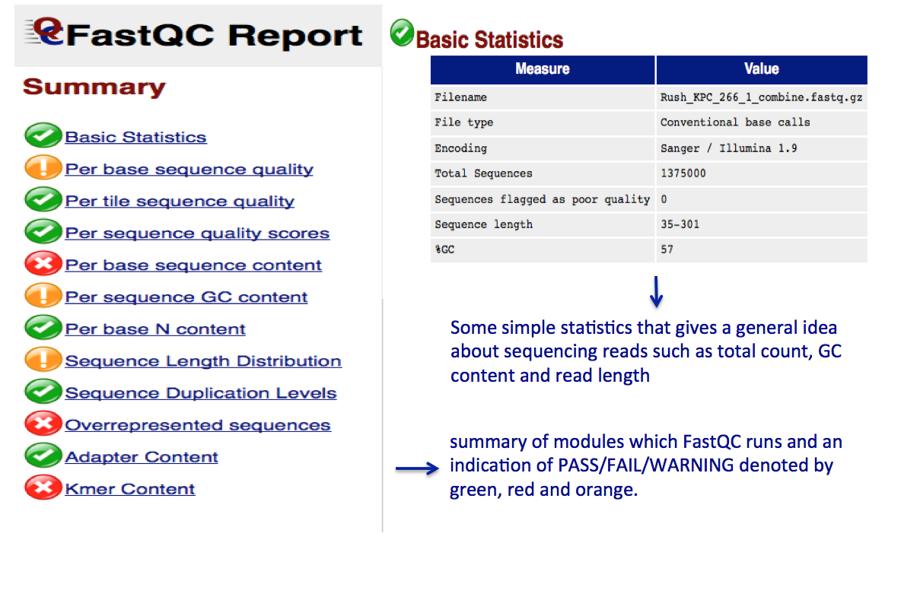

Lets first look at the quality drop(per base sequence quality graph) at the end of "Per Base Sequence Quality" graph. This degredation of quality towards the end of reads is commonly observed in illumina samples. The reason for this drop is that as the number of sequencing cycles performed increases, the average quality of the base calls, as reported by the Phred Scores produced by the sequencer falls. 

Next, lets check the overrepresented sequences graph and the kind of adapters that were used for sequencing these samples (Truseq or Nextera) which comes in handy while indicating the adapter database path during downstream filtering step (Trimmomatic).

 for more detailed explaination as to why quality drops with increasing sequencing cycles.

- [A video FastQC walkthrough created by FastQC developers](https://www.youtube.com/watch?v=bz93ReOv87Y "FastQC video") 

Quality Trimming using [Trimmomatic](http://www.usadellab.org/cms/?page=trimmomatic "Trimmomatic Homepage")
------------------------------------
[[back to top]](day1_morning.html)
[[HOME]](index.html)

Filtering out problematic sequences within a dataset is inherently a trade off between sensitivity (ensuring all contaminant sequences are removed) and specificity (leaving all non-contaminant sequence data intact). Adapter and other technical contaminants can potentially occur in any location within the reads.(start, end, read-through (between the reads), partial adapter sequences)

Trimmomatic is a tool that tries to search these potential contaminant/adapter sequence within the read at all the possible locations. It takes advantage of the added evidence available in paired-end dataset. In paired-end data, read-through/adapters can occur on both the forward and reverse reads of a particular fragment in the same position. Since the fragment was entirely sequenced from both ends, the non-adapter portion of the forward and reverse reads will be reverse-complements of each other. This strategy of searching for contaminant in both the reads is called 'palindrome' mode. 

For more information on how Trimmomatic tries to achieve this, Please refer [this](http://www.usadellab.org/cms/uploads/supplementary/Trimmomatic/TrimmomaticManual_V0.32.pdf) manual.

Now we will run Trimmomatic on these raw data to remove low quality reads as well as adapters. 

> ***i. If the interactive session timed out, get an interactive cluster node again to start running programs and navigate to day1_after directory.***

How to know if you are in interactive session: you should see "username@nyx" in your command prompt

```
iflux

cd /scratch/micro612w19_fluxod/username/day1_after/

#or

d1a
```

> ***ii. Create these output directories in your day1_after folder to save trimmomatic results***

```
mkdir Rush_KPC_266_trimmomatic_results
```

> ***iii. Try to invoke trimmomatic from command line.***

```
java -jar /scratch/micro612w19_fluxod/shared/bin/Trimmomatic/trimmomatic-0.33.jar –h
```

> ***iv. Run the below trimmomatic commands on raw reads.***

```
java -jar /scratch/micro612w19_fluxod/shared/bin/Trimmomatic/trimmomatic-0.33.jar PE Rush_KPC_266_1_combine.fastq.gz Rush_KPC_266_2_combine.fastq.gz Rush_KPC_266_trimmomatic_results/forward_paired.fq.gz Rush_KPC_266_trimmomatic_results/forward_unpaired.fq.gz Rush_KPC_266_trimmomatic_results/reverse_paired.fq.gz Rush_KPC_266_trimmomatic_results/reverse_unpaired.fq.gz ILLUMINACLIP:/scratch/micro612w19_fluxod/shared/bin/Trimmomatic/adapters/TruSeq3-PE.fa:2:30:10:8:true SLIDINGWINDOW:4:15 MINLEN:40 HEADCROP:0
```


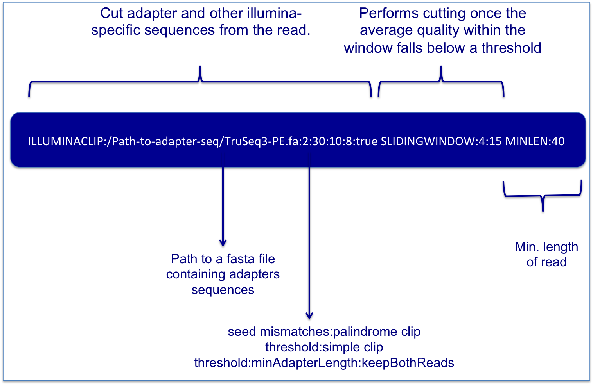

First, Trimmomatic searches for any matches between the reads and adapter sequences. Adapter sequences are stored in this directory of Trimmomatic tool: /scratch/micro612w19_fluxod/shared/bin/Trimmomatic/adapters/. Trimmomatic comes with a list of standard adapter fasta sequences such TruSeq, Nextera etc. You should use appropriate adapter fasta sequence file based on the illumina kit that was used for sequencing. You can get this information from your sequencing centre or can find it in FastQC html report (Section: Overrepresented sequences).

Short sections (2 bp as determined by seed misMatch parameter) of each adapter sequences (contained in TruSeq3-PE.fa) are tested in each possible position within the reads. If it finds a perfect match, It starts searching the entire adapter sequence and scores the alignment. The advantage here is that the full alignment is calculated only when there is a perfect seed match which results in considerable efficiency gains. So, When it finds a match, it moves forward with full alignment and when the match reaches 10 bp determined by simpleClipThreshold, it finally trims off the adapter from reads.  

Quoting Trimmomatic:

"'Palindrome' trimming is specifically designed for the case of 'reading through' a short fragment into the adapter sequence on the other end. In this approach, the appropriate adapter sequences are 'in silico ligated' onto the start of the reads, and the combined adapter+read sequences, forward and reverse are aligned. If they align in a manner which indicates 'read- through' i.e atleast 30 bp match, the forward read is clipped and the reverse read dropped (since it contains no new data)."

> ***v. Now create new directories in day1_after folder and Run FastQC on these trimmomatic results.***

```
mkdir Rush_KPC_266_FastQC_results/after_trimmomatic

fastqc -o Rush_KPC_266_FastQC_results/after_trimmomatic/ Rush_KPC_266_trimmomatic_results/forward_paired.fq.gz Rush_KPC_266_trimmomatic_results/reverse_paired.fq.gz --extract
```

Get these html reports to your local system.

```
scp username@flux-xfer.arc-ts.umich.edu:/scratch/micro612w19_fluxod/username/day1_after/Rush_KPC_266_FastQC_results/after_trimmomatic/*.html /path-to-local-directory/
```

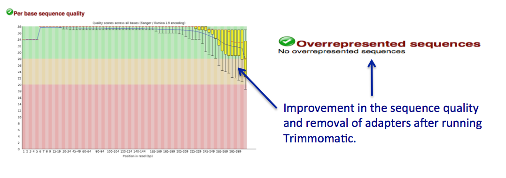

After running Trimmomatic, you should notice that the sequence quality improved (Per base sequence quality) and now it doesn't contain any contaminants/adapters (Overrepresented sequences).

Next, take a look at the per base sequence content graph, and notice that the head bases(~9 bp) are slightly imbalanced. In a perfect scenario, each nucleotide content should run parallel to each other, and should be reflective of the overall A/C/T/G content of your input sequence. 

Quoting FastQC:
	"It's worth noting that some types of library will always produce biased sequence composition, normally at the start of the read. Libraries produced by priming using random hexamers (including nearly all RNA-Seq libraries) and those which were fragmented using transposases inherit an intrinsic bias in the positions at which reads start. This bias does not concern an absolute sequence, but instead provides enrichment of a number of different K-mers at the 5' end of the reads. Whilst this is a true technical bias, it isn't something which can be corrected by trimming and in most cases doesn't seem to adversely affect the downstream analysis. It will however produce a warning or error in this module."

This doesn't look very bad but you can remove the red cross sign by trimming these imbalanced head bases using HEADCROP:9 flag in the above command. This removes the first 9 bases from the start of the read. Often, the start of the read is not good quality, which is why this improves the overall read quality.

> ***vi. Lets Run trimmomatic again with headcrop 9 and save it in a different directory called Rush_KPC_266_trimmomatic_results_with_headcrop/***

```
mkdir Rush_KPC_266_trimmomatic_results_with_headcrop/

time java -jar /scratch/micro612w19_fluxod/shared/bin/Trimmomatic/trimmomatic-0.33.jar PE Rush_KPC_266_1_combine.fastq.gz Rush_KPC_266_2_combine.fastq.gz Rush_KPC_266_trimmomatic_results_with_headcrop/forward_paired.fq.gz Rush_KPC_266_trimmomatic_results_with_headcrop/forward_unpaired.fq.gz Rush_KPC_266_trimmomatic_results_with_headcrop/reverse_paired.fq.gz Rush_KPC_266_trimmomatic_results_with_headcrop/reverse_unpaired.fq.gz ILLUMINACLIP:/scratch/micro612w19_fluxod/shared/bin/Trimmomatic/adapters/TruSeq3-PE.fa:2:30:10:8:true SLIDINGWINDOW:4:20 MINLEN:40 HEADCROP:9
```

Unix gem: time in above command shows how long a command takes to run?

> ***vii. Run FastQC 'one last time' on updated trimmomatic results with headcrop and check report on your local computer***

```
mkdir Rush_KPC_266_FastQC_results/after_trimmomatic_headcrop/
fastqc -o Rush_KPC_266_FastQC_results/after_trimmomatic_headcrop/ --extract -f fastq Rush_KPC_266_trimmomatic_results_with_headcrop/forward_paired.fq.gz Rush_KPC_266_trimmomatic_results_with_headcrop/reverse_paired.fq.gz
```
Download the reports again and see the difference.
```
scp username@flux-xfer.arc-ts.umich.edu:/scratch/micro612w19_fluxod/username/day1_after/Rush_KPC_266_FastQC_results/after_trimmomatic_headcrop/*.html /path-to-local-directory/
```

The red cross sign disappeared!

Lets have a look at one of the Bad Illumina data example [here](http://www.bioinformatics.babraham.ac.uk/projects/fastqc/bad_sequence_fastqc.html)

[[back to top]](day1_morning.html)
[[HOME]](index.html)

Earlier, We performed some quality control steps on our sequencing data to make it clean and usable for various downstream analysis. Now we will perform our first sequence analysis, specifically variant calling, and map these reads to a reference genome and try to find out the differences between them.

Read Mapping is one of the most common Bioinformatics operations that needs to be carried out on NGS data. The main goal behind read mapping/aligning is to find the best possible reference genome position to which reads could be aligned. Reads are generally mapped to a reference genome sequence that is sufficiently closely related genome to accurately align reads. There are number of tools that can map reads to a reference genome and they differ from each other in algorithm, speed and accuracy. Most of these tools work by first building an index of reference sequence which works like a dictionary for fast search/lookup and then applying an alignment algorithm that uses these index to align short read sequences against the reference. 

These alignment has a vast number of uses, including: 

1) variant/SNP calling: Finding differences between your sequenced organism genome and the reference genome
2) coverage estimation: If you have sufficient reads to cover each position of reference genome.
3) gene expression analysis: determining the level of expression of each genes in a genome.

In this session, we will be covering the important steps that are part of any Read mapping/Variant calling bioinformatics pipleine.


Variant Calling for Collistin resistant Klebsiella pneumoniae
-------------------------------------------------------------

At the end of our morning session, we submitted a variant calling job to run all the variant calling steps on PCMP_H326 genome.

The goal of this exercise is to learn what standard variant calling steps are involved, how to combine and run these steps in an automated fashion and explore results that were generated at each step by the script.

Let us see what inputs and commands variant_call.sh script need to run variant calling on PCMP_H326.

Try running the script with help menu and check all the inputs that is required by the script.

```

./variant_call.sh -h

```

USAGE:
variant_call.sh forward_paired reverse_paired reference_genome output_directory basename [-h] -- A simple shell script to run Variant Calling steps on a pair of fastq reads.

The script requires following positional arguments as input to call variants:
1. Forward Paired end reads
2. Reverse Paired end reads
3. Path to Reference Genome Fasta file
4. Output Directory Path. A new directory will be created at this path by the name that you will provide for Analysis Base name. for example: if the output path is /dir_1/dir_2/ and Analysis Base name is sample_name , a new directory by the name sample_name_varcall_result will be created in /dir_1/dir_2/
5. Analysis Base name to store result files with this prefix.

If you remember, we ran the shell script in following fashion.

```

bash ./variant_call.sh PCMP_H326_R1.fastq.gz PCMP_H326_R2.fastq.gz /nfs/esnitkin/micro612w19_fluxod/shared/data/day1_after/KPNIH1.fasta /nfs/esnitkin/micro612w19_fluxod/shared/data/day1_after/PCMP_H326_

```

The script generates PCMP_H326__varcall_result folder in your day1_after folder and the results for each step of variant calling will be organized in 6 different steps folder. Each of these steps represents a particular step involved in variant calling starting from cleaning the reads to calling variants.

**These 6 folders are:**

**1. Step1_cleaning**

**2. Step2_mapping**

**3. Step3_samtobamconversion**

**4. Step4_removeduplicates**

**5. Step5_variantcalling**

**6. Step6_variantfilteraion**


Try listing the folders in PCMP_H326__varcall_result:

```

ls -1ad PCMP_H326__varcall_result/*

```

Step1_cleaning
--------------

This folder contains results generated by Trimmomatic. Since we already went through the results earlier, we will be skipping the Trimmomatic command and move on to Step 2.

Step2_mapping
-------------

[[back to top]](day1_afternoon.html)
[[HOME]](index.html)

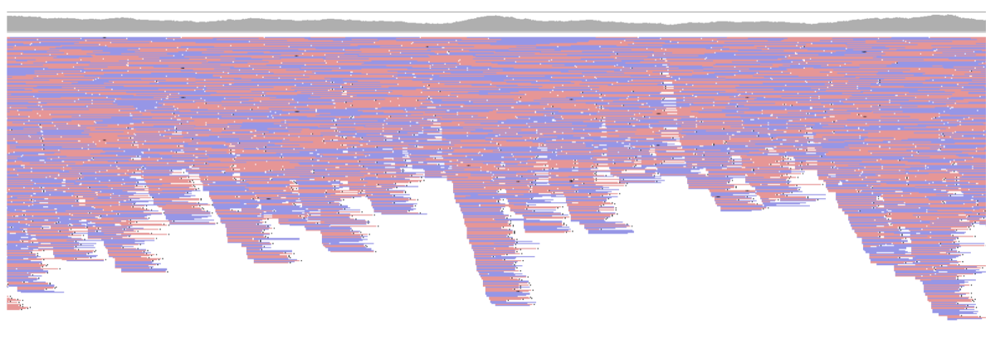

This folder contains results that were generated by mapping reads against a finished reference genome using [BWA](http://bio-bwa.sourceforge.net/bwa.shtml "BWA manual")

Choosing the right read mapper is crucial and should be based on the type of analysis and data you are working with. Each aligners are meant to be better used with specific types of data, for example:

For whole genome or whole exome sequencing data: Use BWA for long reads (> 50/100 bp), use Bowtie2 for short reads (< 50/100bp)
For transcriptomic data (RNA-Seq): use Splice-aware Mapper such as Tophat. (Not applicable for microbial data)

Here, we will be using BWA aligner to map the reads against a reference genome, KPNIH1.

BWA is one of the several read mappers that are based on Burrows-Wheeler transform algorithm. If you feel like challenging yourselves, you can read BWA paper [here](http://bioinformatics.oxfordjournals.org/content/25/14/1754.short) 

Read Mapping is a time-consuming step that involves searching the reference and finding the optimal location for the alignment for millions of reads. Creating an index file of a reference sequence for quick lookup/search operations significantly decreases the time required for read alignment. Imagine indexing a genome sequence like the index at the end of a book. If you want to know on which page a word appears or a chapter begins, it is much more efficient to look it up in a pre-built index than going through every page of the book. Similarly, an index of a large DNA sequence allows aligners to rapidly find shorter sequences embedded within it. 

Note: each read mapper has its own unique way of indexing a reference genome and therefore the reference index created by BWA cannot be used for Bowtie. (Most Bioinformatics tools nowadays require some kind of indexing or reference database creation)

You can move over to Step 2: Read Mapping section in the shell script to see what commands were used for this step.

Most of the Bioinformatics programs as BWA and Bowtie use a computational strategy known as ‘indexing’ to speed up their mapping algorithms. Like the index at the end of a book, an index of a large DNA sequence allows one to rapidly find shorter sequences embedded within it.

The following command creates an index for the reference genome required for BWA aligner. 

```
bwa index KPNIH1.fasta
```
 
This command creates fai index file using samtools that is required by GATK in downstream steps.

```
samtools faidx KPNIH1.fasta
```

Quoting BWA:
"BWA consists of three algorithms: BWA-backtrack, BWA-SW and BWA-MEM. The first algorithm is designed for Illumina sequence reads up to 100bp, while the rest two for longer sequences ranged from 70bp to 1Mbp. BWA-MEM and BWA-SW share similar features such as long-read support and split alignment, but BWA-MEM, which is the latest, is generally recommended for high-quality queries as it is faster and more accurate. BWA-MEM also has better performance than BWA-backtrack for 70-100bp Illumina reads."

For other algorithms employed by BWA, you can refer to BWA [manual](http://bio-bwa.sourceforge.net/bwa.shtml "BWA manual")

The second part of read mapping involves aligning both left and right end reads to our reference using BWA alignment algorithm 'mem'. 

The following command was used to do this job using both forward and reverse end reads along with a reference genome.

```

bwa mem -M -R "@RG     ID:16   SM:PCMP_H326_R1.fastq.gz        LB:1    PL:Illumina" -t 8 /nfs/esnitkin/micro612w19_fluxod/shared/data/day1_after/KPNIH1.fasta /nfs/esnitkin/micro612w19_fluxod/shared/data/day1_after/PCMP_H326__varcall_result/forward_paired.fq.gz /nfs/esnitkin/micro612w19_fluxod/shared/data/day1_after/PCMP_H326__varcall_result/reverse_paired.fq.gz > /nfs/esnitkin/micro612w19_fluxod/shared/data/day1_after/PCMP_H326__varcall_result/PCMP_H326__aln.sam

```

Read group tells aligners/other tools that certain reads were sequenced together on a specific lane. If you have multiplexed samples in a single lane, you will get multiple samples in a single read group. If you sequenced the same sample in several lanes, you will have multiple read groups for the same sample.

This string with -R flag says that all reads belongs to ID:16 and library LB:1; with sample name SM:PCMP_H326_R1.fastq.gz and was sequenced on illumina platform PL:Illumina.

You can extract this information from fastq read header. (@D00728:16:hf2mtbcxx:2:1101:1580:2235 1:N:0:ACTGAGCG+GTAAGGAG)

The output of BWA and most of the short-reads aligners is a SAM file. SAM format is considered as the standard output for most read aligners and stands for Sequence Alignment/Map format. It is a TAB-delimited format that describes how each reads were aligned to the reference sequence. 

Lets explore first few lines of .sam file. Go to day1_after directory and then change directory to PCMP_H326__varcall_result/Step2_mapping/


```
d1a

cd PCMP_H326__varcall_result/Step2_mapping/

head -n4 PCMP_H326__aln.sam

```

example:

```

@SQ	SN:gi|661922017|gb|CP008827.1|	LN:5394056
@RG	ID:16	SM:PCMP_H326_R1.fastq.gz	LB:1	PL:Illumina
@PG	ID:bwa	PN:bwa	VN:0.7.12-r1039	CL:bwa mem -M -R @RG\tID:16\tSM:PCMP_H326_R1.fastq.gz\tLB:1\tPL:Illumina -t 8 /nfs/esnitkin/micro612w19_fluxod/shared/data/day1_after/KPNIH1.fasta /nfs/esnitkin/micro612w19_fluxod/shared/data/day1_after/PCMP_H326__varcall_result/forward_paired.fq.gz /nfs/esnitkin/micro612w19_fluxod/shared/data/day1_after/PCMP_H326__varcall_result/reverse_paired.fq.gz
D00728:16:hf2mtbcxx:2:1101:1580:2235	99	gi|661922017|gb|CP008827.1|	4442353	60	251M	=	4442534	413	GTTCCAGGCGTTCGCCATCCAGCCAAGATTGAGCGCGGTAATACCTTTGTCCCAGAACTCCGGGCTGACATAGTTTTTCAGGCGTTGATCTTCATAGATCTGCGGTACCGAAATGTTCAACCGCAGGGAGGACTGGACCAGGTTGTCTTTGACGTTTTCTTCGTTGCGCCAGGATTTGAGGCTACCGCAGTAGCCCTCCTGCTCGCTCAGCTGCGGATTGAGCTTTTCCGCCGCGATGCCATATTGGGCCA	DDDDDIIHIIIIIIIIIIIIIIIIIIIIIIIIIIIIIIIIIIIIIIIIIIIIIIHIIIIIIIIIIIIIIIIIIHIIIIIIIIIIIIIIIIIIIIIIIIIIIIIIIIIIIIIIIIIIIIIIHHHIIIIIIIIHGHIHHIIIIEHIIIIIIIIIIIHIIIHIHIHIIHIIIHGDHHHIGHHIHHIIIHIIIHIIIIIIIIIHHIIIICHIIHIHIIHGDHHHCGHHIIIGIDHHDH:+CGHHHHHEEHE@E@5	NM:i:0	MD:Z:251	AS:i:25XS:i:0	RG:Z:16

```

The lines starting with "@" is a header section and contains information about reference genome, sample read group and the aligner command that was used for aligning the samples. The header section is followed by an alignment section information for each read. It contains 11 columns and an optional TAG option.

Detailed information about these 11 columns can be obtained from this [pdf](https://www.google.com/url?sa=t&rct=j&q=&esrc=s&source=web&cd=1&ved=0ahUKEwizkvfAk9rLAhXrm4MKHVXxC9kQFggdMAA&url=https%3A%2F%2Fsamtools.github.io%2Fhts-specs%2FSAMv1.pdf&usg=AFQjCNHFmjxTXKnxYqN0WpIFjZNylwPm0Q) document.

The second column consists of coded bitwise flags where each code flag carries important information about the alignment. Open [this](https://broadinstitute.github.io/picard/explain-flags.html) site and enter the flag "99" to find out what it stands for.

The last section "NM:i:0	MD:Z:251	AS:i:25XS:i:0	RG:Z:16" is an optional tag section and varies for different aligners(specifications based on aligners). 

Here, 

NM tag tells number of changes necessary to make it equal to the reference(2 changes)

MD tag tells you what positions in the read alignment are different from reference base and is used by variant callers to call SNP's. 

AS is an alignment score and XS:i:0 is an suboptimal alignment score.

Step3_samtobamconversion
------------------------

The next step involves manipulating the SAM files generated by the BWA aligner using [Samtools](http://www.htslib.org/doc/samtools.html "Samtools Manual")

BAM is the compressed binary equivalent of SAM but are usually quite smaller in size than SAM format. Since, parsing through a SAM format is slow, Most of the downstream tools require SAM file to be converted to BAM so that it can be easily sorted and indexed.

The first section for this step will ask samtools to convert SAM format(-S) to BAM format(-b)

```
samtools view -Sb PCMP_H326__aln.sam > PCMP_H326__aln.bam
```

The next section will sort these converted BAM file using SAMTOOLS

Most of the downstream tools such as GATK requires your BAM file to be indexed and sorted by reference genome positions.

Now before indexing this BAM file, we will sort the data by positions(default) using samtools. Some RNA Seq/Gene expression tools require it to be sorted by read name which is achieved by passing -n flag.

```
samtools sort PCMP_H326__aln.bam PCMP_H326__aln_sort
```

Step4_removeduplicates
----------------------

This step will mark duplicates(PCR optical duplicates) and remove them using [PICARD](http://broadinstitute.github.io/picard/command-line-overview.html#MarkDuplicates "Picard MarkDuplicates")

Illumina sequencing involves PCR amplification of adapter ligated DNA fragments so that we have enough starting material for sequencing. Therefore, some amount of duplicates are inevitable. Ideally, you amplify upto ~65 fold(4% reads) but higher rates of PCR duplicates e.g. 30% arise when people have too little starting material such that greater amplification of the library is needed or some smaller fragments which are easier to PCR amplify, end up over-represented.

For an in-depth explanation about how PCR duplicates arise in sequencing, please refer to this interesting [blog](http://www.cureffi.org/2012/12/11/how-pcr-duplicates-arise-in-next-generation-sequencing/)

Picard identifies duplicates by searching reads that have same start position on reference or in PE reads same start for both ends. It will choose a representative from each group of duplicate reads based on best base quality scores and other criteria and retain it while removing other duplicates. This step plays a significant role in removing false positive variant calls(such as sequencing error) during variant calling that are represented by PCR duplicate reads.


To run this step, we first need to create a dictionary for reference fasta file that is required by PICARD


```

java -jar /scratch/micro612w19_fluxod/shared/bin/picard-tools-1.130/picard.jar CreateSequenceDictionary REFERENCE=KPNIH1.fasta OUTPUT=KPNIH1.dict

```

Once the sequence dictionary is created, PICARD can be run for removing duplicates

```

java -jar /scratch/micro612w19_fluxod/shared/bin/picard-tools-1.130/picard.jar MarkDuplicates REMOVE_DUPLICATES=true INPUT=PCMP_H326__aln_sort.bam OUTPUT=PCMP_H326__aln_marked.bam METRICS_FILE=PCMP_H326__markduplicates_metrics CREATE_INDEX=true VALIDATION_STRINGENCY=LENIENT

```

The output of Picard remove duplicate step is a new bam file "PCMP_H326__aln_marked.bam" without PCR duplicates.

This bam file should be indexed before we can use it for variant calling.


```
samtools index PCMP_H326__aln_marked.bam
```

<!--
Open the markduplicates metrics file and glance through the number and percentage of PCR duplicates removed. 
For more details about each metrics in a metrics file, please refer to [this](https://broadinstitute.github.io/picard/picard-metric-definitions.html#DuplicationMetrics)

```
nano Rush_KPC_266__markduplicates_metrics

#or 

less Rush_KPC_266__markduplicates_metrics
```
-->

Step5_variantcalling
--------------------
[[back to top]](day1_afternoon.html)
[[HOME]](index.html)

One of the downstream uses of read mapping is finding differences between our sequence data against a reference. This step is achieved by carrying out variant calling using any of the variant callers (samtools, gatk, freebayes etc). Each variant caller uses a different statistical framework to discover SNPs and other types of mutations. For those of you who are interested in finding out more about the statistics involved, please refer to [this]() samtools paper, one of most commonly used variant callers.

The [GATK best practices guide](https://www.broadinstitute.org/gatk/guide/best-practices.php) will provide more details about various steps that you can incorporate in your analysis.

There are many published articles that compare different variant callers but this is a very interesting [blog post](https://bcbio.wordpress.com/2013/10/21/updated-comparison-of-variant-detection-methods-ensemble-freebayes-and-minimal-bam-preparation-pipelines/) that compares the performance and accuracy of different variant callers.

Here we will use samtools mpileup to perform this operation on our BAM file and generate a VCF (variant call format) file. 

This step will Call variants using [samtools](http://www.htslib.org/doc/samtools.html "samtools manual") mpileup and [bcftools](https://samtools.github.io/bcftools/bcftools.html "bcftools")**

```

samtools mpileup -ug -f KPNIH1.fasta PCMP_H326__aln_marked.bam | bcftools call -O v -v -c -o PCMP_H326__aln_mpileup_raw.vcf

#In the above command, we are using samtools mpileup to generate a pileup formatted file from BAM alignments and genotype likelihoods (-g flag) in BCF format (binary version of vcf). This bcf output is then piped to bcftools, which calls variants and outputs them in vcf format (-c flag for using consensus calling algorithm  and -v for outputting variants positions only)


```

Let's go through the VCF file and try to understand a few important VCF specifications and criteria that we can use for filtering low confidence SNPs. 

Go to Step5_variantcalling folder under PCMP_H326__varcall_result folder.

```

d1a

cd PCMP_H326__varcall_result/Step5_variantcalling

less PCMP_H326__aln_mpileup_raw.vcf

```

1. CHROM, POS: 1st and 2nd column represent the reference genome name and reference base position where a variant was called
2. REF, ALT: 4th and 5th columns represent the reference allele at the position and alternate/variant allele called from the reads
3. QUAL: Phred-scaled quality score for the assertion made in ALT
4. INFO: Additional information that provides technical scores and obervations for each variant. Important parameters to look for: Depth (DP), mapping quality (MQ), FQ (consensus score), allele frequency for each ALT allele (AF)

VCF format stores a large variety of information and you can find more details in [this pdf](https://www.google.com/url?sa=t&rct=j&q=&esrc=s&source=web&cd=1&ved=0ahUKEwit35bvktzLAhVHkoMKHe3hAhYQFggdMAA&url=https%3A%2F%2Fsamtools.github.io%2Fhts-specs%2FVCFv4.2.pdf&usg=AFQjCNGFka33WgRmvOfOfp4nSaCzkV95HA&sig2=tPLD6jW5ALombN3ALRiCZg&cad=rja).

Lets count the number of raw unfiltered variants found:

```
grep -v '#' PCMP_H326__aln_mpileup_raw.vcf | wc -l

grep -v '#' PCMP_H326__aln_mpileup_raw.vcf | grep 'INDEL' | wc -l
```

Step6_variantfilteraion
-----------------------

This step will filter variants and process file generation using [GATK](https://www.broadinstitute.org/gatk/guide/tooldocs/org_broadinstitute_gatk_tools_walkers_filters_VariantFiltration.php "GATK Variant Filteration"):

There are various tools that can you can try for variant filteration such as vcftools, GATK, vcfutils etc. Here we will use GATK VariantFiltration utility to filter out low confidence variants.

```

java -jar /scratch/micro612w19_fluxod/shared/bin/GenomeAnalysisTK-3.3-0/GenomeAnalysisTK.jar -T VariantFiltration -R KPNIH1.fasta -o PCMP_H326__filter_gatk.vcf --variant PCMP_H326__aln_mpileup_raw.vcf --filterExpression "FQ < 0.025 && MQ > 50 && QUAL > 100 && DP > 15" --filterName pass_filter

```

This command will add a 'pass_filter' text in the 7th FILTER column for those variant positions that passed our filtered criteria:

1. DP: Depth of reads. More than 15 reads supporting a variant call at these position.
2. MQ: Root Mean Square Mapping Quality. This provides an estimation of the overall mapping quality of reads supporting a variant call. The root mean square is equivalent to the mean of the mapping qualities plus the standard deviation of the mapping qualities.
3. QUAL stands for phred-scaled quality score for the assertion made in ALT. High QUAL scores indicate high confidence calls.
4. FQ stands for consensus quality. A positive value indicates heterozygote and a negative value indicates homozygous. In bacterial analysis, this plays an important role in defining if a gene was duplicated in a particular sample. We will learn more about this later while visualizing our BAM files in Artemis.

Check if the pass_filter was added properly and count the number of variants that passed the filter.

```
grep 'pass_filter' PCMP_H326__filter_gatk.vcf | head

```

***Caveat: This filter criteria should be applied carefully after giving some thought to the type of library, coverage, average mapping quality, type of analysis and other such requirements.***

The next section will Remove indels and keep only SNPS that passed our filter criteria using [the vcftools manual](http://vcftools.sourceforge.net/man_latest.html):***

vcftools is a program package that is especially written to work with vcf file formats. It thus saves your precious time by making available all the common operations that you would like to perform on the vcf file using a single command. One such operation is removing INDEL information from a vcf file.

Now, let's remove indels from our final vcf file and keep only variants that passed our filter criteria (positions with pass_filter in their FILTER column).

```

vcftools --vcf PCMP_H326__filter_gatk.vcf --keep-filtered pass_filter --remove-indels --recode --recode-INFO-all --out PCMP_H326__filter_onlysnp

```

<!--
commenting out consensus generation
>iii. Generate Consensus fasta file from filtered variants using vcftools:
A consensus fasta sequence will contain alleles from reference sequence at positions where no variants were observed and variants that were observed at positions described in vcf file.
Run the commands below to generate a consensus fasta sequence.
```
bgzip Rush_KPC_266__filter_onlysnp.recode.vcf
tabix Rush_KPC_266__filter_onlysnp.recode.vcf.gz
cat ../KPNIH1.fasta | vcf-consensus Rush_KPC_266__filter_onlysnp.recode.vcf.gz > Rush_KPC_266__consensus.fa
```
> Note: Dont forget to put the actual path to the refeerence sequence in place of /path-to-reference/
Check the fasta header and change it using sed.
```
head -n1 Rush_KPC_266__consensus.fa
sed -i 's/>.*/>Rush_KPC_266_/g' Rush_KPC_266__consensus.fa 
```
-->


Variant Annotation using snpEff
-------------------------------

Variant annotation is one of the crucial steps in any variant calling pipeline. Most of the variant annotation tools create their own database or use an external one to assign function and predict the effect of variants on genes. We will try to touch base on some basic steps of annotating variants in our vcf file using snpEff. 

You can annotate these variants before performing any filtering steps that we did earlier or you can decide to annotate just the final filtered variants. 

snpEff contains a database of about 20,000 reference genomes built from trusted and public sources. Lets check if snpEff contains a database of our reference genome.

> ***i. Check snpEff internal database for your reference genome:***

```     
java -jar /scratch/micro612w19_fluxod/shared/bin/snpEff/snpEff.jar databases | grep 'kpnih1'
```

The existing KPNIH1 reference database doesn't contain mgrB annotation in it so we built a custom database out of a custom KPNIH1 genbank file. The procedure to configure a custom database can be found [here](http://snpeff.sourceforge.net/SnpEff_manual.html#databases). 


<!--
Note down the genome id for your reference genome KPNIH1. In this case: GCA_000281535.2.29

> ***ii. Change the chromosome name in the vcf file to ‘Chromosome’ for snpEff reference database compatibility.***

```
sed -i 's/gi.*|/Chromosome/g' Rush_KPC_266__filter_gatk.vcf
```
-->


> ***ii. Run snpEff for variant annotation.***

```

java -Xmx4g -jar /scratch/micro612w19_fluxod/shared/bin/snpEff/snpEff.jar -csvStats PCMP_H326__filter_gatk_stats -dataDir /scratch/micro612w19_fluxod/shared/bin/snpEff/data/ -d -no-downstream -no-upstream -c /scratch/micro612w19_fluxod/shared/bin/snpEff/snpEff.config KPNIH1 PCMP_H326__filter_gatk.vcf > PCMP_H326__filter_gatk_ann.vcf

```

The STDOUT  will print out some useful details such as genome name and version being used, no. of genes, protein-coding genes and transcripts, chromosome and plasmid names etc.

snpEff will add an extra field named 'ANN' at the end of INFO field. Lets go through the ANN field added after annotation step.

Now go to Step6_variantfilteraion folder under PCMP_H326__varcall_result. 

```
d1a 

cd PCMP_H326__varcall_result/Step6_variantfilteraion
```


```
grep 'ANN=' PCMP_H326__filter_gatk_ann.vcf | head -n1

or to print on seperate lines

grep -o 'ANN=.*GT:PL' PCMP_H326__filter_gatk_ann.vcf | head -n1 | tr '|' '\n' | cat --number
```

The ANN field will provide information such as the impact of variants (HIGH/LOW/MODERATE/MODIFIER) on genes and transcripts along with other useful annotations.

Detailed information of the ANN field and sequence ontology terms that it uses can be found [here](http://snpeff.sourceforge.net/SnpEff_manual.html#input).

Let's see how many SNPs and Indels passed the filter using grep and wc.

```

No. of Variants:
grep '^gi|' PCMP_H326__filter_gatk_ann.vcf | wc -l

No. of Variants that passed the filter:
grep '^gi|.*pass_filter' PCMP_H326__filter_gatk_ann.vcf | wc -l

No. of SNPs that passed the filter:
grep '^gi|.*pass_filter' PCMP_H326__filter_gatk_ann.vcf | grep -v 'INDEL' | wc -l

No. of Indels that passed the filter:
grep '^gi|.*pass_filter' PCMP_H326__filter_gatk_ann.vcf | grep 'INDEL' | wc -l


```

We wrote a small python script parser to parse the annotated vcf file and print out some important annotation related fields in a table format. 

Run the below parser on your final annotated file PCMP_H326__filter_gatk_ann.vcf as shown below

```
module load python-anaconda2/latest 

python /scratch/micro612w19_fluxod/shared/bin/snpEff_parse.py -genbank /path-to/day1_after/KPNIH1.gb -vcf PCMP_H326__filter_gatk_ann.vcf

```

This script will generate a new csv file called PCMP_H326__parsed.csv with extracted annotated information printed in a table format. Let's take a look at these parsed annotated features from variant filtering.

First, make sure you're in the directory where `PCMP_H326__parsed.csv` is stored:
```
ls PCMP_H326__parsed.csv
```

Let's look at what the different columns contain:
```
head -n 1 PCMP_H326__parsed.csv | tr ',' '\n' | cat -n
```

Now that we know what the different columns are, let's look at the whole file using less (can you figure out what the `-S` flag does?):
```
less -S PCMP_H326__parsed.csv
```

How many high-impact variants are there based on the snpEff annotation?
```
 grep HIGH PCMP_H326__parsed.csv | wc -l
```

What proteins are these high-impact variants in?
```
grep HIGH PCMP_H326__parsed.csv | cut -d$'\t' -f4
```

How many of each type of high-impact variants are there?
```
grep HIGH PCMP_H326__parsed.csv | cut -d$'\t' -f5  | sort | uniq -c
```

What are the actual variant changes?
```
 grep HIGH PCMP_H326__parsed.csv | cut -d$'\t' -f10
```

Let's get the protein and variant change together:
```
grep HIGH PCMP_H326__parsed.csv | cut -d$'\t' -f4,10
```

What if we want to look specifically for mutations in mgrB? (what does the `-i` flag do?)
```
 grep -i mgrb PCMP_H326__parsed.csv
```

Generate Alignment Statistics
-----------------------------

Often, while analyzing sequencing data, we are required to make sure that our analysis steps are correct. Some statistics about our analysis will help us in making that decision. So Lets try to get some statistics about various outputs that were created using the above steps and check if everything makes sense.

Go to your day1_after directory.

```

d1a

```

> ***i. Collect Alignment statistics using Picard***

Run the below command on your marked.bam file

```

java -jar /scratch/micro612w19_fluxod/shared/bin/picard-tools-1.130/picard.jar CollectAlignmentSummaryMetrics R=KPNIH1.fasta I=PCMP_H326__varcall_result/Step5_variantcalling/PCMP_H326__aln_marked.bam O=AlignmentSummaryMetrics.txt

```
Open the file AlignmentSummaryMetrics.txt and explore various statistics. It will generate various statistics and the definition for each can be found [here](http://broadinstitute.github.io/picard/picard-metric-definitions.html#AlignmentSummaryMetrics)

The file AlignmentSummaryMetrics.txt contains many columns and at times it becomes difficult to extract information from a particular column if we dont know the exact column number. Run the below unix gem to print column name with its number.

```
grep 'CATEGORY' AlignmentSummaryMetrics.txt | tr '\t' '\n' | cat --number
```

- Question: Extract alignment percentage from AlignmentSummaryMetrics file. (% of reads aligned to reference genome)

<!---
awk -F'\t' '{print $7}' AlignmentSummaryMetrics.txt
-->

```
grep -v '#' AlignmentSummaryMetrics.txt | cut -f7
```

Try to explore other statistics and their definitions from Picard AlignmentSummaryMetrics [link](http://broadinstitute.github.io/picard/picard-metric-definitions.html#AlignmentSummaryMetrics)

> ***ii. Estimate read coverage/read depth using Picard***

Read coverage/depth describes the average number of reads that align to, or "cover," known reference bases. The sequencing depth is one of the most crucial issue in the design of next-generation sequencing experiments. This [paper](https://www.nature.com/articles/nrg3642) review current guidelines and precedents on the issue of coverage, as well as their underlying considerations, for four major study designs, which include de novo genome sequencing, genome resequencing, transcriptome sequencing and genomic location analyses 

After read mapping, it is important to make sure that the reference bases are represented by enough read depth before making any inferences such as variant calling.

```
java -jar /scratch/micro612w19_fluxod/shared/bin/picard-tools-1.130/picard.jar CollectWgsMetrics R=KPNIH1.fasta I=PCMP_H326__varcall_result/Step5_variantcalling/PCMP_H326__aln_marked.bam O=WgsMetrics.txt

```

Open the file "WgsMetrics.txt" and explore various statistics. It will generate various statistics and the definition for each can be found [here](https://broadinstitute.github.io/picard/picard-metric-definitions.html#CollectWgsMetrics.WgsMetrics).

Print column names

```
grep 'GENOME_TERRITORY' WgsMetrics.txt | tr '\t' '\n' | cat --number
```

Since "WgsMetrics.txt" also contains histogram information, we will run commands on only the first few lines to extract information.


- Question: Extract mean coverage information from "WgsMetrics.txt"

<!---
sed -n 7,8p WgsMetrics.txt | awk -F'\t' '{print $2}'
-->

```
grep -v '#' WgsMetrics.txt | cut -f2 | head -n3

```

> Question: Percentage of bases that attained at least 5X sequence coverage.

```
grep -v '#' WgsMetrics.txt | cut -f13 | head -n3
```

> Question: Percentage of bases that had siginificantly high coverage. Regions with unusually high depth sometimes indicate either repetitive regions or PCR amplification bias.

```
grep -v '#' WgsMetrics.txt | cut -f25 | head -n3
```

<!--
## Generate Alignment Statistics report using [Qualimap](http://qualimap.bioinfo.cipf.es/)
Qualimap outputs a very informative report about the alignments and coverage across the entire genome. Lets create one for our sample. The below command calls bamqc utility of qualimap and generates a report in pdf format.
``` 
qualimap bamqc -bam Rush_KPC_266__aln_sort.bam -outdir ./ -outfile Rush_KPC_266__report.pdf -outformat pdf 
```
Lets get this pdf report onto our local system and check the chromosome stats table, mapping quality and coverage across the entire reference genome.
```
scp username@flux-xfer.arc-ts.umich.edu:/scratch/micro612w19_fluxod/username/day1_after/Rush_KPC_266_varcall_result/Rush_KPC_266__report.pdf /path-to-local-directory/
```
-->

Visualize BAM and VCF files in [IGV](http://software.broadinstitute.org/software/igv/) (Integrative Genome Viewer)
------------------------------------------------------------------------------------------------------------------

[[back to top]](day1_afternoon.html)
[[HOME]](index.html)

While these various statistical/text analyses are helpful, visualization of all of these various output files can help in making some significant decisions and inferences about your entire analysis. There are a wide variety of visualization tools out there that you can choose from for this purpose.

We will be using [IGV](http://software.broadinstitute.org/software/igv/) (Integrative Genome Viewer) here, developed by the Broad Institute for viewing BAM and VCF files for manual inspection of some of the variants.


- ***Required Input files:***

> - KPNIH1 reference fasta 
> - KPNIH1 genbank file
> - PCMP_H326__aln_sort.bam 
> - PCMP_H326__aln_sort.bam.bai
> - PCMP_H326__aln_sort__filter_gatk_ann.vcf.gz 
> - PCMP_H326__aln_sort__filter_gatk_ann.vcf.gz.tbi

Let's make a seperate folder (make sure you are in the `day1_after` folder) for the files that we need for visualization and copy it to that folder:

```

mkdir IGV_files

cp KPNIH1.fasta KPNIH1.gb PCMP_H326__varcall_result/*/PCMP_H326__aln_sort.bam* PCMP_H326__varcall_result/*/PCMP_H326__filter_gatk_ann.vcf.gz* IGV_files/

```

Open a new terminal and run the scp command or cyberduck to get these files to your local system:

```

scp -r username@flux-xfer.arc-ts.umich.edu:/scratch/micro612w19_fluxod/username/day1_after/PCMP_H326__varcall_result/IGV_files/ /path-to-local-directory/

#You can use ~/Desktop/ as your local directory path
```

Start IGV.

Load the following files (each is a separate panel or 'track'):
- `Genomes` &rarr; `Load Genome from File` &rarr; navigate to `IGV_files` &rarr; `KPNIH1.fasta`
  - Shows where in the genome you are at the top
- `File` &rarr; `Load from File` &rarr; navigate to `IGV_files` &rarr; `KPNIH1.gb`
  - Shows what genes are present (looks like a blue bar when zoomed out)
- `File` &rarr; `Load from File` &rarr; navigate to `IGV_files` &rarr; `PCMP_H326__aln_sort__filter_gatk_ann.vcf.gz`
  - Shows variants found in the sample (when you zoom in)
- `File` &rarr; `Load from File` &rarr; navigate to `IGV_files` &rarr; `PCMP_H326__aln_sort.bam`
  - Shows coverage and reads aligned to the reference (when you zoom in)
  
By default, the whole genome is shown:

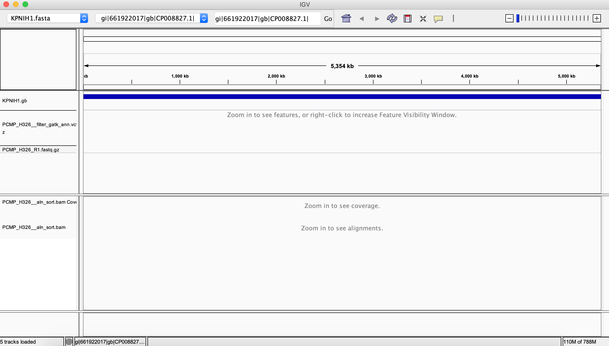
  
Using the plus sign in the top right corner of the window, zoom in by clicking 3 times
- You should see grey bars in the vcf track and blue bars in the fastq track, both showing variant positions
- You can hover over the bars to get more information about the variant
- Light grey and light blue indicate homozygous variants, while dark grey and dark blue indicate heterozygous variants
- You can navigate to different sections of the genome by moving the red bar at the top
  
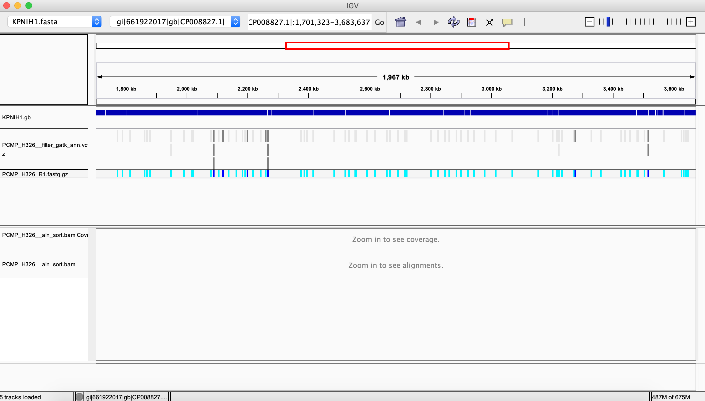

Zoom in ~5 more times until you see reads appear in the bottom part of the window
  - You should see coverage and reads mapped in bottom half of the window
  - Different colors indicate different variants
  - In the Coverage track, the y-axis indicates read coverage
  - You can now also see distinct genes in the genbank annotation track
  - You can hover over a read to get more information about it
  
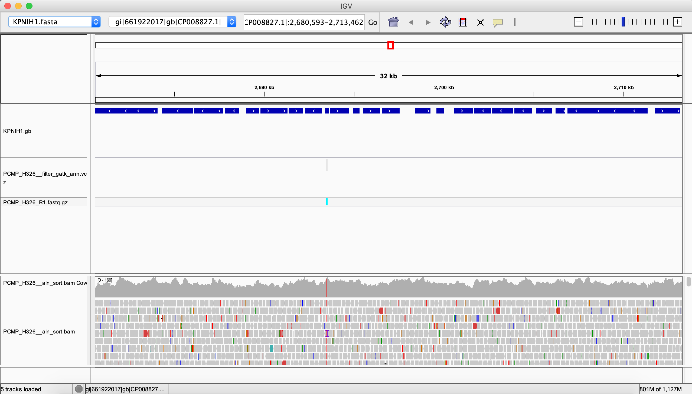
  
To see all of the reads, you can click the square with the arrows pointing to each corner, found in the top-middle-right of the window:

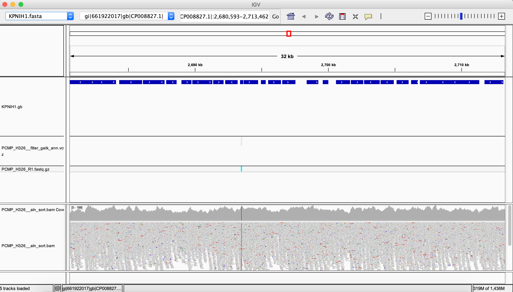

If you zoom in all the way, you can see the nucleotide sequence at the bottom of the screen as well as nucleotide variants in the reads:

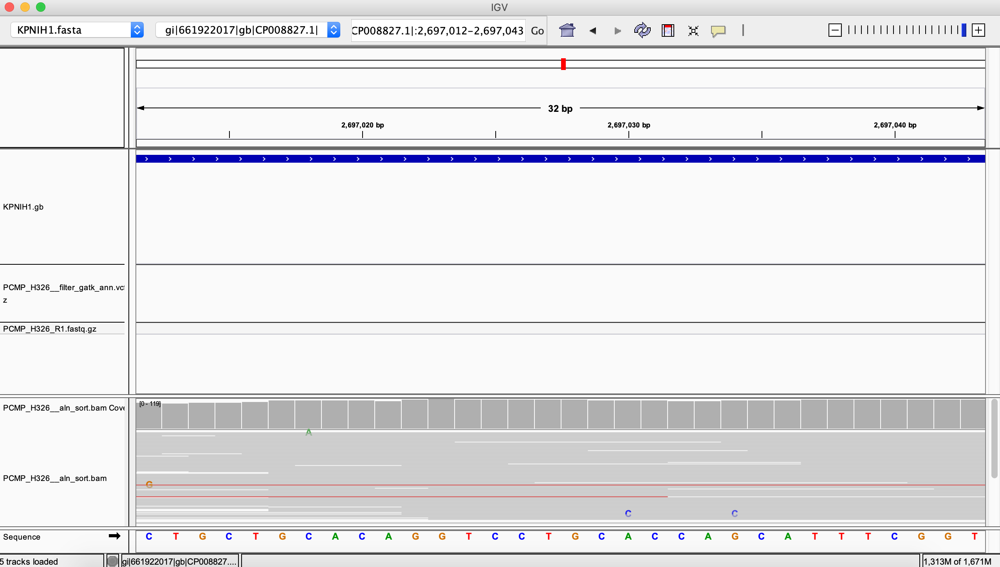

Now that you know the basics of how to use IGV, let's navigate to the mgrB gene to look at mutations that might make this sample resistant to colistin. 
- In the top middle bar of the window, type in gi|661922017|gb|CP008827.1|:3,359,811-3,360,323
- Look at the gene annotation by hovering over the blue bar to see what gene it is
- What is the nucleotide of the SNP in the sample? The amino acid change? 
- Do you think this variant might be the cause of colistin resistance? Why or why not?

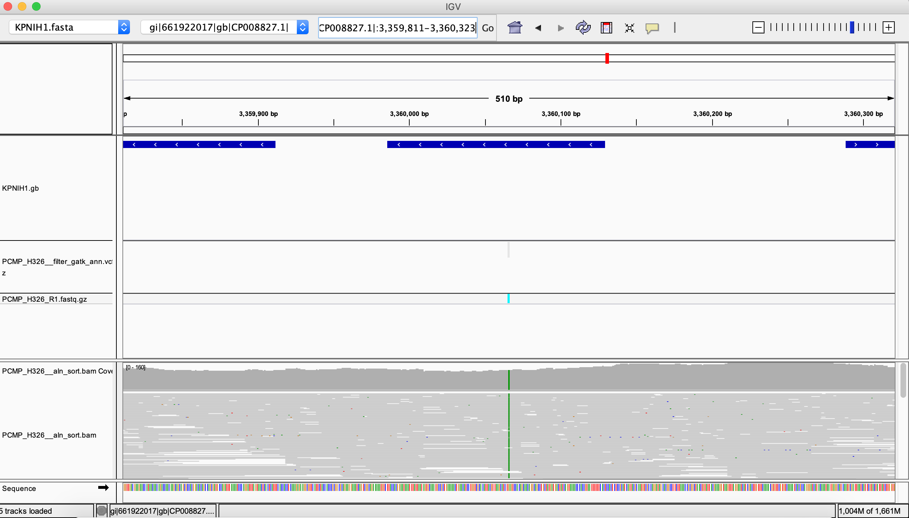


Now let's look an example of a heterozygous variant - variant positions where more than one allele (variant) with sufficiently high read depth are observed. 
- Navigate to gi|661922017|gb|CP008827.1|:2,265,249-2,273,465
- You can see that there are a lot of heterozygous variants in one region. 
  - We removed these types of variants during our Variant Filteration step using the FQ value. (If the FQ is unusually high, it is suggestive of a heterozygous variant and negative FQ value is a suggestive of true variant as observed in the mapped reads) 
- In the region with lots of heterozygous variants, the read coverage is much higher than in the flanking regions (the regions on either side), and much higher than the rest of the genome coverage. 
- Why do you think this region contains many heterozygous variants and a higher read coverage than the rest of the genome?
- You can also see that there are some places with no reads and no coverage. What does this mean?

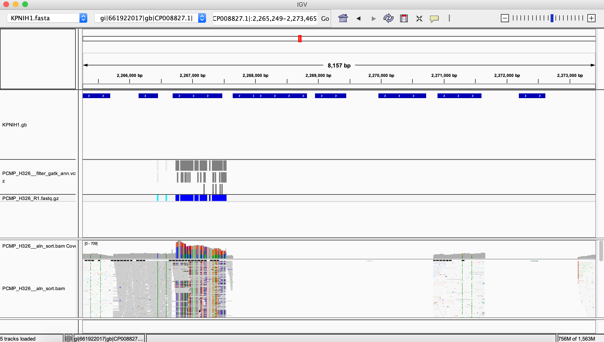

You can inspect these type of HET variants later for any gene duplication or copy number analysis (by extracting variant positions with high FQ values). Addition of these details will give a better resolution while inferring phylogenetic trees.

You can refer to the [IGV User Guide](http://software.broadinstitute.org/software/igv/userguide) for more information about how to use IGV. 

[[back to top]](day1_afternoon.html)
[[HOME]](index.html)


Exercise – Daptomycin resistance in VRE
---------------------------------------

Today we ran a variant calling pipeline for a colistin resistant isolate against a susceptible reference. In that case the susceptible reference genome was somewhat arbitrarily selected, in that it had no epidemiologic relationship to the resistant isolate. This worked out, because we had an idea of what gene the resistance mutation should be in, and we were able to fish it out from the relatively large number of differences. In this exercise we will take a different approach of comparing our resistant isolate to a susceptible isolate from the same patient. In particular, these samples both come from a patient infected with VRE before and after treatment with daptomycin. The first sample was the patient’s initial sample and is susceptible to daptomycin, and the second was after daptomycin resistance emerged during treatment. Your goal is to map reads from the resistant genome (VRE_daptoR)  to the susceptible reference (VRE_daptoS_ref_strain.fa) and search for variants that may be associated with resistance. To accomplish this you will run the programs from this session to generate filtered variant files (VCF), and then explore these variants in IGV to see what genes they are in (we have provided you with a gff file with gene annotations that can be loaded into IGV - VRE_daptoS_gene_annot.gff3). To help with your interpretation, see if you see any genes hit that were reported in this paper, which was the first to identify putative daptomycin resistance loci (hint: non-coding variants can be functional, so make sure you look at what genes are downstream of inter-genic variants ). Your steps should be:

1) Create a PBS script to run the shell script in the directory and submit to cluster

2) Load files into IGV and examine annotations of genes in or around variants in filtered vcf (*note snpEff annotation should be skipped because our reference is not in the database)

Exercise – Colistin resistance in Acinetobacter
-----------------------------------------------

In the second exercise we will try and find a mutation that is in a colistin resistant Acinetobacter isolate from a patient, but not in a colistin susceptible isolate from the same patient. In this case, it turned out that despite being from the same patient, the resistant and susceptible genomes are quite different. Therefore, we will focus on differences in a known resistance gene (pmrB). Your task is to run the variant calling and annotation pipelines for SRR7591081 (colR) and SRR6513781 (colS) against the ACICU reference genome (ACICU.fasta). You will then look for pmrB mutations that are in the resistant strain, that are not in the susceptible one. Did the mutation you found match the one from the paper (Patient 1 in https://aac.asm.org/content/early/2019/01/04/AAC.01586-18.abstract)? Your steps should be:

1) Create two PBS scripts comparing your colR and colS genomes to the reference genomes and submit to cluster
2) Perform variant annotation against the ACICU reference genome with snpEff
3) Create parsed annotated variant matrix
4) Determine if colR has a pmrB mutation that the colS isolate does not, and compare it to the mutation found in the paper
